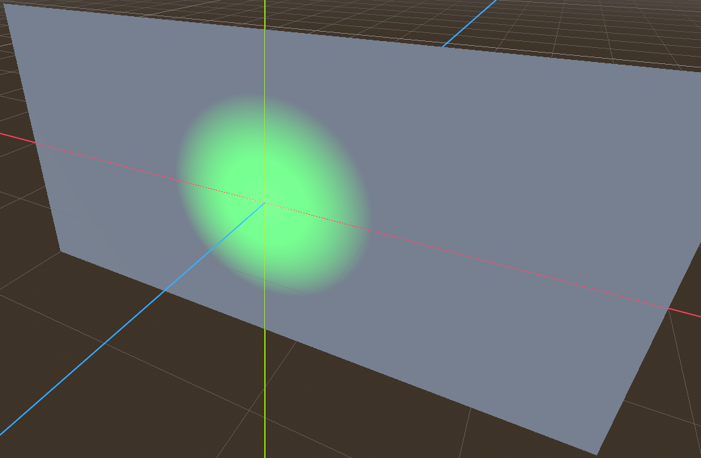

# Light Visiblity test for KHR_node_visibility

This model demonstrates the `KHR_node_visibility` extension and its interaction with `KHR_animation_pointer`.

- If your implementation shows any of the red lights, it is not compliant with `KHR_node_visibility`.

- If your implementation does not have the blue light hiding and showing every 0.5 seconds, either the animation is not playing, or it does not support using `KHR_animation_pointer` to animate the `KHR_node_visibility` visible property.

Animated screenshot of the test model in action:

[Show](https://gltf-interactivity.needle.tools?model=https://raw.githubusercontent.com/KhronosGroup/glTF-Interactivity-Sample-Assets/main/Models/LightVisibility/glTF-Binary/LightVisibility.glb) – [Download GLB](https://raw.githubusercontent.com/KhronosGroup/glTF-Interactivity-Sample-Assets/main/Models/LightVisibility/glTF-Binary/LightVisibility.glb)
